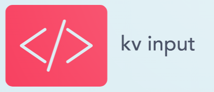
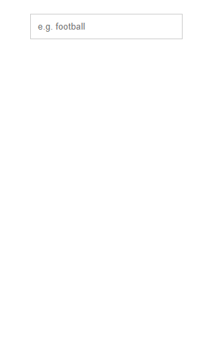

<div align="center">
  
</div>
<h3 align="center">KV INPUT</h3>
</br>
<h5></h5>
<p align="center">KV INPUT is а Angular 10 component that supports form control and lets you choose a single predefined value from a dropdown list or input a custom value.</p>

## Table of contents

- [Example](#example)
- [How to use KV Input](#how-to-use-kv-input)
- [Purpose and usage](#purpose-and-usage)
- [Documentation](#documentation)
- [Purpose and usage](#status)
- [Creator](#creator)
- [Further help](#further-help)
- [Copyright and license](#copyright-and-license)

## Example




## How to use KV Input
<strong>KV input is extremely easy to use.</strong>

All you have to do is import the "KvInputModule" into the app.module file or another suitable module of your choice in the imports and providers of your module.

Example:
```text
  import { KvInputModule } from './components/kv-input kv-input.module';

  @NgModule({
  declarations: [
  ],
  imports: [
    KvInputModule
  ],
  providers: [
    KvInputModule
  ],
  bootstrap: [AppComponent]
})
export class AppModule { }

```

Next step is to put KV Input in our html

```text
   <app-kv-input 
      [maxDropDownSuggestions]='10'
      [placeholder]="'e.g. football'"
      [data]="data" 
      formControlName="kvInput">
  </app-kv-input>
```

That's it! You will have nice and easy custom input field in your application. Cheers :)
## Purpose and usage 
<strong>KV input is an easy and convenient Angular 10 component that can be easy to use and extremely fast implemented in another Angular project.The component is the solution for upgrades to the default input field.</strong>

<p>Such a component would definitely be appropriate when we need to allow users to choose from the <strong>suggestions data</strong>, who we can pre-define.</p>

<p>Ass well user can easily add new suggestions is need to click only Enter in KV Input and the suggestion will show on previews typing. This will save the user time and will make our applications more convenient to use.</p>

<strong>KV Input can be used with or without form control!</strong>

</br>

# Documentation
 - Angular - 10.2.0;
 - TypeScript - 4.0.2;
 - Jasmine - 3.6.0;
 - Karma - 5.0.0;
-----

<strong>List of KV Input - @Inputs</strong>

```text
    @Input() data: IKvInputDropdownItem[];
    @Input() placeholder: string;
    @Input() isDisabled: boolean;
    @Input() showInputClearButton: boolean;
    @Input() maxDropDownSuggestions;
```

<strong>List of KV Input - @Output </strong>
```text
  @Output() getInputValue: EventEmitter<any>;
```

------
</br>

## Basic usage: 
</br>

```text
    @Input() data: IKvInputDropdownItem[];

    Array[{index: number, value: string}]
   
```

Allow to add data to KV Input suggestion drop down. If is empty the drop-down will not show.

If the user press Enter and add a new word drop-down suggestion list will show with the selected word.

-----

```text
    @Input() placeholder: string;

    string;
```
Custom placeholder for KV Input. If input is not set the default placeholder will be used { Type ...}

---

```text
    @Input() isDisabled: boolean;

    boolean;
```
If is set to true Input will be disabled.

----

```text
    @Input() showInputClearButton: boolean;

    boolean;
```
By default clear button will be shown. If you want to disable it put this input to  true;


---
```text
    @Input() maxDropDownSuggestions: number;

    number
```

Allow to controls how many suggestions will show the KV Input drop-down.

By default: 10 suggestions

</br>
</br>

### Output

```text
  @Output() getInputValue: EventEmitter<string>;

  string;
  
```

If we don't want to use KV Input as a formControl then we can easily use this Output to handle input value.

------
## Basic accessibility 
Of course, many more functionalities can be added to this component, such as:

- instead of using a "ul list" to display the items in the drop-down we can use a listbox with its events.
- new @Inputs can be added to manipulate the input itself and related drop-down
- to add different ways for dropdown list animation 
- to add other Keyboard Navigation besides the ones that KV Input now has as - Click, Focus, Blur, Key up, Key bottom, Enter
- and many others ...

Note: more info about listbox -> 
[Listbox](https://www.w3.org/TR/wai-aria/#listbox)

## Creator
Christiyan Velkov

## Further help

Email: christiyan.velkov@gmail.com

## Copyright and license

Christiyan Velkov - ©2020  - All rights reserved
</br>
License: MIT